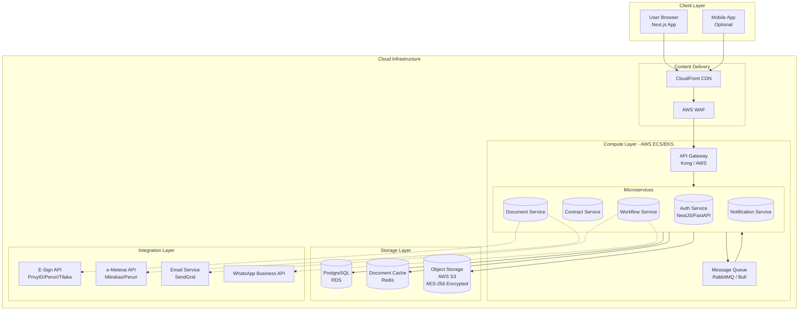

### 🧭Pilihan Backend

| Pilihan Backend | Kecepatan Development | Performa & Skalabilitas | Tipe Data & Validasi | Ketersediaan SDK/Integrasi |
| :--- | :--- | :--- | :--- | :--- |
| **NestJS (Node.js)** | Cukup Cepat (TypeScript modern) | Tinggi (Async, non-blocking) | Object-Oriented (Entity/DTO) | Sangat Baik (NPM kaya pustaka) |
| **FastAPI (Python)** | **Sangat Cepat** (Kode minimal) | Tinggi (Async native) | Data Validation Otomatis (Pydantic) | Baik (Banyak tersedia) |

---

## 🏗️ 1. Arsitektur Aplikasi

Berikut adalah arsitektur sistem secara garis besar, lengkap dengan alur data dan integrasi.



---

## ⚙️ 2. Panduan Implementasi Teknologi

### 📄 Backend: NestJS (Node.js) dengan TypeORM

Inisialisasi proyek dan konfigurasi database dengan aman.

```bash
# 1. Install NestJS CLI dan buat proyek baru
npm i -g @nestjs/cli
nest new contract-management-backend
cd contract-management-backend

# 2. Install dependencies untuk database, environment, dan validasi
npm install @nestjs/typeorm typeorm pg @nestjs/config joi class-validator class-transformer
```

Buat konfigurasi database yang robust dengan autentikasi dan migrasi.

```typescript
// config/database.ts
import { registerAs } from '@nestjs/config';
import { PostgresConnectionOptions } from 'typeorm/driver/postgres/PostgresConnectionOptions';

export default registerAs('database', (): PostgresConnectionOptions => ({
  type: 'postgres',
  host: process.env.DATABASE_HOST,
  port: parseInt(process.env.DATABASE_PORT, 10) || 5432,
  username: process.env.DATABASE_USER,
  password: process.env.DATABASE_PASSWORD,
  database: process.env.DATABASE_NAME,
  entities: [__dirname + '/../**/*.entity{.ts,.js}'],
  synchronize: false, // Matikan di production!
  migrations: [__dirname + '/../database/migrations/*{.ts,.js}'],
  migrationsRun: true,
  logging: process.env.NODE_ENV !== 'production',
}));
```

> **💡 Alternatif Cepat**: Untuk mempercepat development, gunakan template yang sudah menyertakan konfigurasi database, logging, dan testing ini.

### ⚡ Alternatif: Backend Python dengan FastAPI

Jika memilih Python, gunakan struktur ini dengan SQLAlchemy untuk ORM dan Pydantic untuk validasi data.

```python
# main.py - Contoh aplikasi FastAPI sederhana
from fastapi import FastAPI, Depends, HTTPException, status
from fastapi.security import HTTPBearer, HTTPAuthorizationCredentials
from sqlalchemy.orm import Session
from . import models, schemas, crud, auth

app = FastAPI(title="Contract Management System API", version="1.0.0")
security = HTTPBearer()

# Dependency untuk mendapatkan database session
def get_db():
    db = SessionLocal()
    try:
        yield db
    finally:
        db.close()

@app.post("/api/v1/contracts/", response_model=schemas.Contract)
def create_contract(
    contract: schemas.ContractCreate,
    db: Session = Depends(get_db),
    credentials: HTTPAuthorizationCredentials = Depends(security)
):
    # 1. Verifikasi token user dari header Authorization
    current_user = auth.verify_token(credentials.credentials)

    # 2. Simpan data kontrak ke database
    db_contract = models.Contract(**contract.dict(), owner_id=current_user.id)
    db.add(db_contract)
    db.commit()
    db.refresh(db_contract)
    return db_contract
```

### 🎨 Frontend: Next.js 14 (App Router) dengan Prisma ORM

Untuk authentication, solusi yang umum dan teruji adalah dengan JWT dan HttpOnly Cookies, yang diatur melalui middleware Next.js.

```typescript
// middleware.ts - Melindungi route yang memerlukan autentikasi
import { NextResponse } from 'next/server';
import type { NextRequest } from 'next/server';
import { verifyJwtToken } from './lib/auth';

export function middleware(request: NextRequest) {
    const token = request.cookies.get('token')?.value;
    const isAuthPage = request.nextUrl.pathname.startsWith('/login');

    if (isAuthPage) {
        if (token) return NextResponse.redirect(new URL('/dashboard', request.url));
        return NextResponse.next();
    }

    if (!token) return NextResponse.redirect(new URL('/login', request.url));

    // Verifikasi token JWT
    const verifiedToken = verifyJwtToken(token);
    if (!verifiedToken) return NextResponse.redirect(new URL('/login', request.url));

    return NextResponse.next();
}

export const config = { matcher: ['/dashboard/:path*', '/contracts/:path*'] };
```

> **💡 Alternatif Cepat**: Proyek seperti `auth-nextjs-prisma` memberikan contoh konkret implementasi sign-up, login, dan protected routes dengan JWT dan cookies.

---

## 🔐 3. Integrasi PSrE & e-Meterai (Jantung Aplikasi)

Halaman resmi KOMINFO (tte.kominfo.go.id/listPSrE) menyediakan daftar lengkap PSrE terdaftar, memastikan pilihan Anda valid secara hukum. Saat ini ada 9 PSrE yang terdaftar di KOMINFO. Berikut adalah rincian teknisnya:

### 🆔 Daftar PSrE Resmi & e-Meterai

| Penyedia | Status PSrE (KOMINFO) | Produk Utama | Integrasi API | Target Pengguna |
| :--- | :--- | :--- | :--- | :--- |
| **PrivyID** | **Tersertifikasi** | Digital ID, E-Sign, e-Meterai | REST API, Python/Nuxt SDK | ~40 Juta |
| **Peruri (PDS)** | **Tersertifikasi (BUMN)** | E-Sign, e-Meterai, Cyber Security | API Suite | Pemerintah & Perusahaan Besar |
| **Tilaka** | **Tersertifikasi** | Digital ID, Biometric, E-Sign | REST API / Webview | Perbankan & Fintech |
| **VIDA** | **Tersertifikasi** | E-Sign, e-Meterai, eKYC | REST API | Enterprise Skala Besar |
| **Mitrakas** | Distributor Resmi e-Meterai | e-Meterai | API | Wholeseller, Platform Pajak |

### 📜 Contoh Alur Integrasi e-Meterai (via VIDA API)

Alur ini menunjukkan bagaimana sebuah sistem dapat terintegrasi langsung dengan penyedia e-Meterai resmi, Peruri, melalui API seperti VIDA.

1.  **Persiapan Dokumen**: User meng-upload dokumen PDF yang memerlukan meterai.
2.  **Request Stamping**: Sistem backend Anda mengirim permintaan ke API e-Meterai (misal, via `POST /stamp` ke API VIDA).
3.  **Verifikasi & Penerbitan**: API VIDA akan terhubung ke backend **Peruri** untuk menerbitkan e-Meterai yang valid secara legal.
4.  **Pembubuhan Otomatis**: Setelah diterbitkan, e-Meterai akan ditempelkan secara otomatis ke area dokumen yang telah ditentukan.
5.  **Finalisasi & Tanda Tangan**: Proses stamping ini dapat dilakukan bersamaan dengan alur tanda tangan digital, sehingga dokumen menjadi lengkap dan sah secara hukum (binding signature and stamp).

### 💡 Poin Penting Integrasi

*   **Setiap permintaan ke PrivyID harus disertakan header `Authorization: Basic` dengan App ID sebagai username dan App Secret sebagai password.**
*   **Untuk pembubuhan e-Meterai, Anda harus terhubung langsung atau tidak langsung dengan Peruri Digital Security (PDS) agar setiap e-Meterai yang terbit tercatat secara resmi dan dapat diverifikasi.**
*   **Seluruh jejak audit, mulai dari verifikasi identitas, proses tanda tangan, hingga pembubuhan e-Meterai, WAJIB disimpan sebagai arsip elektronik yang dapat diverifikasi kapan saja di situs resmi KOMINFO (tte.kominfo.go.id/verifyPDF).**.

---

## 🗄️ 4. Struktur Database (ERD) dengan PostgreSQL

Untuk efisiensi dan kecepatan development, saya telah memisahkan dataset dalam 2 bagian:

### 📊 A. ERD untuk Core System (Modul `contracts`, `workflows`, `users`)

ERD ini mencakup inti dari manajemen kontrak, approval, dan pengguna yang langsung dapat diimplementasikan.

**`contracts`**
- `id` (UUID, PK)
- `contract_number` (VARCHAR, Unique)
- `title` (VARCHAR)
- `type` (ENUM)
- `status` (ENUM)
- `effective_date` (DATE)
- `expiry_date` (DATE)
- `value` (DECIMAL)
- `currency` (VARCHAR(3))
- `created_by` (UUID, FK ke `users.id`)
- `created_at` (TIMESTAMP)

**`users`**
- `id` (UUID, PK)
- `email` (VARCHAR, Unique)
- `password_hash` (VARCHAR)
- `full_name` (VARCHAR)
- `role` (ENUM)
- `is_active` (BOOLEAN)
- `last_login` (TIMESTAMP)

**`approval_workflows`**
- `id` (UUID, PK)
- `contract_id` (UUID, FK ke `contracts.id`)
- `current_step` (INT)
- `status` (ENUM)
- `created_at` (TIMESTAMP)

**`approval_histories`**
- `id` (UUID, PK)
- `workflow_id` (UUID, FK ke `approval_workflows.id`)
- `approver_id` (UUID, FK ke `users.id`)
- `action` (ENUM: 'approved', 'rejected', 'revised')
- `comment` (TEXT)
- `created_at` (TIMESTAMP)

### 🤝 B. ERD untuk Integrasi Pihak Ketiga

Struktur ini dirancang untuk mencatat seluruh proses integrasi dengan layanan eksternal.

**`signature_requests`**
- `id` (UUID, PK)
- `contract_id` (UUID, FK ke `contracts.id`)
- `signer_email` (VARCHAR)
- `signer_name` (VARCHAR)
- `provider` (ENUM: 'privyid', 'peruri', 'tilaka')
- `provider_request_id` (VARCHAR)
- `status` (ENUM)
- `requested_at` (TIMESTAMP)
- `completed_at` (TIMESTAMP)
- `certificate_hash` (TEXT)
- `signature_log` (JSONB)

**`e_meterai_logs`**
- `id` (UUID, PK)
- `contract_id` (UUID, FK ke `contracts.id`)
- `provider` (ENUM: 'mitrakas', 'peruri', 'vida')
- `meterai_number` (VARCHAR)
- `applied_at` (TIMESTAMP)
- `verification_url` (TEXT)
- `api_response` (JSONB)

**`notifications`**
- `id` (UUID, PK)
- `recipient` (VARCHAR)
- `type` (ENUM: 'email', 'whatsapp')
- `subject` (VARCHAR)
- `content` (TEXT)
- `status` (ENUM: 'pending', 'sent', 'failed')
- `provider_response` (JSONB)
- `sent_at` (TIMESTAMP)

---

## 🌐 5. Deployment & Infrastruktur

### ☁️ Platform Cloud (Data Center Lokal Indonesia)

| Platform Cloud | Data Center di Indonesia | Keuntungan Utama untuk CMS Anda |
| :--- | :--- | :--- |
| **AWS (Jakarta)** | ✅ ap-southeast-3 | Paling matang, layanan terluas, dan kepatuhan tinggi. |
| **Google Cloud (Jakarta)** | ✅ asia-southeast2 | Keunggulan di analitik data dan AI untuk *contract analytics*. |
| **Alibaba Cloud (Jakarta)** | ✅ Indonesia | Sangat kompetitif dalam *pricing*, latensi rendah. |
| **PGN/Neurone** | ✅ Indonesia | Cloud lokal dengan jaminan kedaulatan data yang kuat. |

### 🐳 Docker Compose untuk Development (NestJS + PostgreSQL + Redis)

Gunakan `docker-compose.yml` untuk memulai environment development yang konsisten.

```yaml
# docker-compose.yml
version: '3.8'
services:
  api:
    build:
      context: ./backend # Ganti dengan folder backend Anda (NestJS/FastAPI)
      dockerfile: Dockerfile
    ports:
      - "3000:3000"
    env_file:
      - ./backend/.env
    depends_on:
      - postgres_db
      - redis_cache

  postgres_db:
    image: postgres:15-alpine
    environment:
      POSTGRES_USER: ${DB_USER}
      POSTGRES_PASSWORD: ${DB_PASSWORD}
      POSTGRES_DB: ${DB_NAME}
    ports:
      - "5432:5432"
    volumes:
      - postgres_data:/var/lib/postgresql/data

  redis_cache:
    image: redis:7-alpine
    ports:
      - "6379:6379"
    volumes:
      - redis_data:/data

volumes:
  postgres_data:
  redis_data:
```

---

Berikut adalah detail teknis untuk fitur **Redlining** (perbandingan perubahan dokumen) pada Contract Management System Anda, mencakup **skema database** dan **struktur kode** (backend & frontend) yang siap diimplementasikan.

Redlining adalah kemampuan untuk melacak, menyorot, dan menyetujui/menolak perubahan pada dokumen kontrak – sangat kritis untuk negosiasi antar pihak.

---

## 1. Skema Database untuk Redlining & Versioning

Kita perlu menyimpan setiap versi dokumen beserta *delta* perubahannya, serta metadata perubahan.

### 🗃️ Tabel Tambahan

```sql
-- 1. Menyimpan versi dokumen kontrak (selain file mentah di S3)
CREATE TABLE contract_versions (
    id UUID PRIMARY KEY DEFAULT gen_random_uuid(),
    contract_id UUID NOT NULL REFERENCES contracts(id) ON DELETE CASCADE,
    version_number INTEGER NOT NULL,
    file_key VARCHAR(255) NOT NULL,        -- Path di S3/Cloud Storage
    file_hash VARCHAR(64) NOT NULL,        -- SHA-256 untuk integritas
    file_size BIGINT,
    mime_type VARCHAR(100) DEFAULT 'application/pdf',
    is_current BOOLEAN DEFAULT FALSE,
    created_by UUID REFERENCES users(id),
    created_at TIMESTAMP WITH TIME ZONE DEFAULT NOW(),
    UNIQUE(contract_id, version_number)
);

-- 2. Menyimpan sesi redlining (perubahan yang belum disetujui/ditolak)
CREATE TABLE redlining_sessions (
    id UUID PRIMARY KEY DEFAULT gen_random_uuid(),
    contract_id UUID NOT NULL REFERENCES contracts(id),
    base_version_id UUID NOT NULL REFERENCES contract_versions(id), -- versi awal
    target_version_id UUID REFERENCES contract_versions(id),        -- versi hasil setelah apply perubahan
    status VARCHAR(20) NOT NULL DEFAULT 'draft',    -- draft, in_review, accepted, rejected, partially_accepted
    initiated_by UUID REFERENCES users(id),
    initiated_at TIMESTAMP WITH TIME ZONE DEFAULT NOW(),
    completed_at TIMESTAMP WITH TIME ZONE
);

-- 3. Menyimpan setiap perubahan (operasi diff) dalam sesi redlining (format JSON/Delta)
CREATE TABLE redlining_changes (
    id UUID PRIMARY KEY DEFAULT gen_random_uuid(),
    session_id UUID NOT NULL REFERENCES redlining_sessions(id) ON DELETE CASCADE,
    change_type VARCHAR(20) NOT NULL,       -- insert, delete, replace, format_change
    original_text TEXT,                     -- teks yang dihapus/diganti
    proposed_text TEXT,                     -- teks usulan baru
    start_position INTEGER,                 -- offset karakter awal (untuk teks)
    end_position INTEGER,                   -- offset akhir
    page_number INTEGER,                    -- untuk dokumen PDF jika perlu
    author_id UUID REFERENCES users(id),    -- siapa yang mengusulkan perubahan
    status VARCHAR(20) DEFAULT 'pending',   -- pending, accepted, rejected
    parent_change_id UUID NULL,             -- untuk perubahan bersarang (nested)
    metadata JSONB,                         -- info tambahan: warna, komentar reviewer
    created_at TIMESTAMP WITH TIME ZONE DEFAULT NOW(),
    resolved_at TIMESTAMP WITH TIME ZONE
);

-- 4. Menyimpan komentar pada perubahan tertentu (seperti review/feedback)
CREATE TABLE redlining_comments (
    id UUID PRIMARY KEY DEFAULT gen_random_uuid(),
    change_id UUID NOT NULL REFERENCES redlining_changes(id) ON DELETE CASCADE,
    user_id UUID REFERENCES users(id),
    comment TEXT NOT NULL,
    created_at TIMESTAMP WITH TIME ZONE DEFAULT NOW()
);

-- Indeks untuk performa
CREATE INDEX idx_contract_versions_contract ON contract_versions(contract_id);
CREATE INDEX idx_redlining_sessions_contract ON redlining_sessions(contract_id);
CREATE INDEX idx_redlining_changes_session ON redlining_changes(session_id);
```

### 📦 Alternatif: Penyimpanan Delta sebagai JSON (untuk kolaborasi real-time)

Jika menggunakan format seperti **Operational Transformation** atau **CRDT**, Anda bisa menyimpan seluruh riwayat perubahan dalam satu kolom `JSONB` di tabel `contract_versions`:

```sql
ALTER TABLE contract_versions ADD COLUMN delta_ops JSONB;
-- Contoh isi delta_ops:
-- [
--   { "op": "insert", "pos": 153, "text": "pembayaran dilakukan dalam 30 hari" },
--   { "op": "delete", "pos": 200, "len": 45 }
-- ]
```

Pendekatan ini memudahkan *replay* perubahan tanpa perlu parsing diff berulang.

---

## 2. Struktur Kode Backend (NestJS / FastAPI)

### 🔹 NestJS (TypeScript) - Service untuk Redlining

```typescript
// modules/redlining/redlining.service.ts
import { Injectable, NotFoundException } from '@nestjs/common';
import { InjectRepository } from '@nestjs/typeorm';
import { Repository } from 'typeorm';
import { RedliningSession } from './entities/redlining-session.entity';
import { RedliningChange } from './entities/redlining-change.entity';
import { ContractVersion } from '../contract/entities/contract-version.entity';
import { DiffService } from './diff.service'; // import library diff

@Injectable()
export class RedliningService {
  constructor(
    @InjectRepository(RedliningSession)
    private sessionRepo: Repository<RedliningSession>,
    @InjectRepository(RedliningChange)
    private changeRepo: Repository<RedliningChange>,
    @InjectRepository(ContractVersion)
    private versionRepo: Repository<ContractVersion>,
    private diffService: DiffService,
  ) {}

  // Membuat sesi redlining baru dari dua versi dokumen
  async createSession(contractId: string, baseVersionId: string, proposedVersionId: string, userId: string) {
    const baseVersion = await this.versionRepo.findOneBy({ id: baseVersionId });
    const proposedVersion = await this.versionRepo.findOneBy({ id: proposedVersionId });
    if (!baseVersion || !proposedVersion) throw new NotFoundException('Version not found');

    // Ambil teks dokumen dari S3 (misal, convert PDF ke teks atau pakai raw text)
    const baseText = await this.diffService.extractTextFromFile(baseVersion.fileKey);
    const proposedText = await this.diffService.extractTextFromFile(proposedVersion.fileKey);

    // Hitung diff menggunakan library (misal 'diff' atau 'google-diff-match-patch')
    const diffResult = this.diffService.computeDiff(baseText, proposedText);

    // Buat session
    const session = this.sessionRepo.create({
      contractId,
      baseVersionId,
      targetVersionId: proposedVersionId,
      status: 'draft',
      initiatedBy: userId,
    });
    await this.sessionRepo.save(session);

    // Simpan setiap perubahan sebagai entitas RedliningChange
    const changes = diffResult.map(d => this.changeRepo.create({
      sessionId: session.id,
      changeType: d.type, // 'insert', 'delete', 'replace'
      originalText: d.original,
      proposedText: d.proposed,
      startPosition: d.start,
      endPosition: d.end,
      authorId: userId,
      status: 'pending',
    }));
    await this.changeRepo.save(changes);

    return session;
  }

  // Menerima atau menolak perubahan tertentu
  async resolveChange(changeId: string, action: 'accept' | 'reject', reviewerId: string) {
    const change = await this.changeRepo.findOne({ where: { id: changeId }, relations: ['session'] });
    if (!change) throw new NotFoundException('Change not found');

    change.status = action === 'accept' ? 'accepted' : 'rejected';
    change.resolvedAt = new Date();
    // (Opsional) Simpan siapa yang me-review
    // change.resolvedBy = reviewerId; 
    await this.changeRepo.save(change);

    // Jika semua perubahan dalam session sudah di-resolve, update status session
    const session = change.session;
    const allChanges = await this.changeRepo.findBy({ sessionId: session.id });
    const allResolved = allChanges.every(c => c.status !== 'pending');
    if (allResolved) {
      session.status = 'partially_accepted'; // atau 'accepted' jika semua diterima
      await this.sessionRepo.save(session);
    }
    return change;
  }

  // Menghasilkan dokumen final setelah semua perubahan diterima
  async generateFinalDocument(sessionId: string): Promise<string> {
    const session = await this.sessionRepo.findOne({ where: { id: sessionId }, relations: ['baseVersion'] });
    const changes = await this.changeRepo.find({ where: { sessionId, status: 'accepted' } });
    
    let finalText = await this.diffService.extractTextFromFile(session.baseVersion.fileKey);
    // Apply accepted changes in order (urutan berdasarkan start_position)
    changes.sort((a,b) => a.startPosition - b.startPosition);
    for (const ch of changes) {
      finalText = this.applyChange(finalText, ch);
    }
    // Simpan sebagai versi baru di S3 dan buat entri contract_versions
    const newVersionKey = await this.diffService.saveTextAsFile(finalText, session.contractId);
    const newVersion = this.versionRepo.create({
      contractId: session.contractId,
      versionNumber: session.baseVersion.versionNumber + 1,
      fileKey: newVersionKey,
      isCurrent: true,
    });
    await this.versionRepo.save(newVersion);
    return newVersionKey;
  }

  private applyChange(text: string, change: RedliningChange): string {
    // implementasi logika insert/delete/replace berdasarkan posisi
    if (change.changeType === 'delete') {
      return text.slice(0, change.startPosition) + text.slice(change.endPosition);
    } else if (change.changeType === 'insert') {
      return text.slice(0, change.startPosition) + change.proposedText + text.slice(change.startPosition);
    } else if (change.changeType === 'replace') {
      return text.slice(0, change.startPosition) + change.proposedText + text.slice(change.endPosition);
    }
    return text;
  }
}
```

### 🔹 FastAPI (Python) - Alternatif dengan `diff-match-patch`

```python
# services/redlining.py
from fastapi import HTTPException
from sqlalchemy.orm import Session
from db.models import RedliningSession, RedliningChange, ContractVersion
from diff_match_patch import diff_match_patch
import boto3

dmp = diff_match_patch()

def create_redlining_session(db: Session, contract_id: str, base_version_id: str, proposed_version_id: str, user_id: str):
    # Ambil teks dari S3
    base_version = db.query(ContractVersion).filter_by(id=base_version_id).first()
    proposed_version = db.query(ContractVersion).filter_by(id=proposed_version_id).first()
    if not base_version or not proposed_version:
        raise HTTPException(404, "Version not found")
    
    base_text = download_from_s3(base_version.file_key)
    proposed_text = download_from_s3(proposed_version.file_key)
    
    # Hitung diff
    diffs = dmp.diff_main(base_text, proposed_text)
    dmp.diff_cleanupSemantic(diffs)
    
    # Buat session
    session = RedliningSession(
        contract_id=contract_id,
        base_version_id=base_version_id,
        target_version_id=proposed_version_id,
        initiated_by=user_id
    )
    db.add(session)
    db.commit()
    db.refresh(session)
    
    # Simpan setiap perubahan
    position = 0
    for (op, text) in diffs:
        if op == 0:  # equal
            position += len(text)
        elif op == -1:  # delete
            change = RedliningChange(
                session_id=session.id,
                change_type="delete",
                original_text=text,
                start_position=position,
                end_position=position + len(text),
                author_id=user_id
            )
            db.add(change)
            position += len(text)
        elif op == 1:  # insert
            change = RedliningChange(
                session_id=session.id,
                change_type="insert",
                proposed_text=text,
                start_position=position,
                end_position=position,  # insert tidak menghapus
                author_id=user_id
            )
            db.add(change)
            # position tidak berubah karena hanya menyisipkan
    db.commit()
    return session
```

---

## 3. Struktur Kode Frontend (Next.js) - Menampilkan Redlining

Menggunakan pustaka seperti **react-diff-viewer** atau **monaco-editor** dengan mode diff.

### 📄 Komponen RedliningViewer (dengan menerima/menolak)

```tsx
// components/contract/RedliningViewer.tsx
'use client';
import { useState, useEffect } from 'react';
import ReactDiffViewer, { DiffMethod } from 'react-diff-viewer-continued';
import { Button, Card, Tag, Tooltip } from 'antd';
import { CheckOutlined, CloseOutlined } from '@ant-design/icons';

interface Change {
  id: string;
  type: 'insert' | 'delete' | 'replace';
  originalText: string;
  proposedText: string;
  status: 'pending' | 'accepted' | 'rejected';
}

export default function RedliningViewer({ sessionId, baseText, proposedText, onResolve }) {
  const [changes, setChanges] = useState<Change[]>([]);
  const [currentHover, setCurrentHover] = useState<string | null>(null);

  useEffect(() => {
    fetchChanges(sessionId).then(setChanges);
  }, [sessionId]);

  const handleAccept = async (changeId: string) => {
    await fetch(`/api/redlining/change/${changeId}/accept`, { method: 'POST' });
    onResolve(changeId, 'accepted');
    setChanges(prev => prev.map(c => c.id === changeId ? { ...c, status: 'accepted' } : c));
  };

  const handleReject = async (changeId: string) => {
    await fetch(`/api/redlining/change/${changeId}/reject`, { method: 'POST' });
    onResolve(changeId, 'rejected');
    setChanges(prev => prev.map(c => c.id === changeId ? { ...c, status: 'rejected' } : c));
  };

  // Customisasi tampilan diff: menambahkan tombol aksi pada setiap perubahan
  const renderLine = ({ lineNumber, content, type, ...props }) => {
    // Cari perubahan yang terkait dengan baris ini (berdasarkan posisi)
    const change = changes.find(c => c.startPosition <= lineNumber && c.endPosition >= lineNumber);
    if (change && change.status === 'pending') {
      return (
        <div className="relative hover:bg-yellow-50" onMouseEnter={() => setCurrentHover(change.id)}>
          <pre {...props}>{content}</pre>
          {currentHover === change.id && (
            <div className="absolute right-2 top-0 flex gap-1">
              <Tooltip title="Accept">
                <Button size="small" icon={<CheckOutlined />} onClick={() => handleAccept(change.id)} />
              </Tooltip>
              <Tooltip title="Reject">
                <Button size="small" icon={<CloseOutlined />} onClick={() => handleReject(change.id)} />
              </Tooltip>
            </div>
          )}
        </div>
      );
    }
    return <pre {...props}>{content}</pre>;
  };

  return (
    <Card title="Redlining Session - Review Changes">
      <ReactDiffViewer
        oldValue={baseText}
        newValue={proposedText}
        splitView={true}
        compareMethod={DiffMethod.WORDS}
        renderContent={renderLine}
        leftTitle="Original Document"
        rightTitle="Proposed Changes"
        showDiffOnly={false}
      />
      <div className="mt-4 flex justify-end">
        <Button type="primary" onClick={() => finalizeSession(sessionId)}>
          Apply Accepted Changes
        </Button>
      </div>
    </Card>
  );
}

async function fetchChanges(sessionId: string): Promise<Change[]> {
  const res = await fetch(`/api/redlining/session/${sessionId}/changes`);
  return res.json();
}

async function finalizeSession(sessionId: string) {
  await fetch(`/api/redlining/session/${sessionId}/finalize`, { method: 'POST' });
  alert('Final document generated!');
}
```

### 🔌 API Endpoint (Next.js Route Handler)

```typescript
// app/api/redlining/session/[sessionId]/changes/route.ts
import { NextRequest, NextResponse } from 'next/server';
import { getServerSession } from 'next-auth';
import { prisma } from '@/lib/prisma';

export async function GET(req: NextRequest, { params }: { params: { sessionId: string } }) {
  const session = await getServerSession();
  if (!session) return NextResponse.json({ error: 'Unauthorized' }, { status: 401 });

  const changes = await prisma.redliningChange.findMany({
    where: { sessionId: params.sessionId },
    orderBy: { startPosition: 'asc' },
  });
  return NextResponse.json(changes);
}

export async function POST(req: NextRequest, { params }: { params: { sessionId: string } }) {
  // endpoint untuk finalize (menggabungkan perubahan yang diterima)
  const body = await req.json();
  // panggil backend service (NestJS/ FastAPI) via internal API
  const response = await fetch(`${process.env.BACKEND_URL}/redlining/session/${params.sessionId}/finalize`, {
    method: 'POST',
    headers: { 'Content-Type': 'application/json' },
    body: JSON.stringify(body),
  });
  return NextResponse.json(await response.json());
}
```

---

## 4. Integrasi dengan PSrE & e-Meterai Setelah Redlining Selesai

Setelah semua perubahan diterima dan dokumen final dihasilkan, alur selanjutnya adalah:

1. **Generate final document** (seperti method `generateFinalDocument` di atas).
2. **Kirim dokumen ke penyedia e-Meterai & e-Sign** (PrivyID/Peruri).
3. **Simpan hash tanda tangan dan e-Meterai** ke dalam `contract_versions` dan `signature_requests`.

Contoh snippet pemanggilan API e-Sign setelah redlining selesai:

```typescript
// Setelah final doc siap
async function requestSigning(contractId: string, finalVersionId: string, signers: string[]) {
  const docUrl = await getDocumentDownloadUrl(finalVersionId);
  const signRequest = await fetch('https://api.privy.id/api/v1/signing-requests', {
    method: 'POST',
    headers: { 'Authorization': `Basic ${Buffer.from(`${PRIVY_CLIENT_ID}:${PRIVY_SECRET}`).toString('base64')}` },
    body: JSON.stringify({
      document_url: docUrl,
      signers: signers.map(email => ({ email, method: 'digital_signature' })),
      redirect_url: `${processBaseUrl}/contract/${contractId}/sign-status`,
    })
  });
  const { request_id, signing_url } = await signRequest.json();
  // Simpan request_id ke database sebagai pending
  return signing_url;
}
```

---

## 5. Alur End-to-End Redlining (User Flow)

1. **User A** mengunggah versi baru kontrak (revisi) → sistem membuat `contract_versions` baru.
2. **User B** (misal legal) membandingkan versi lama dan baru → sistem membuat `redlining_sessions` & `redlining_changes`.
3. **User B** melihat diff di frontend, bisa **accept/reject** setiap perubahan, menambahkan komentar.
4. Setiap perubahan yang diterima/ditolak tercatat statusnya di `redlining_changes`.
5. Jika sesi selesai, sistem menghasilkan dokumen final (versi baru) berdasarkan perubahan yang diterima.
6. Dokumen final dikirim ke workflow tanda tangan elektronik dan e-Meterai.

Dengan skema dan kode di atas, Anda memiliki fondasi kuat untuk fitur redlining yang setara dengan aplikasi CLM komersial, sekaligus memenuhi kepatuhan hukum Indonesia.
